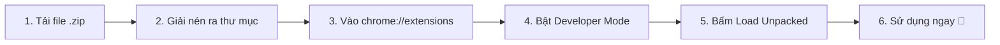

# 🚀 ExtensionApp - Kho Tiện Ích Trình Duyệt (Browser Extensions Hub)

Tổng hợp các tiện ích mở rộng (Chrome Extensions) hữu ích, tối ưu hiệu suất, giao diện đẹp và hoàn toàn miễn phí do **[yansuogaming](https://github.com/yansuogaming)** phát triển.

---

## 📦 Danh Sách Extension

| STT | Tên Extension | Mô Tả & Tính Năng | Phiên Bản | Tải Về (.zip) | Hướng Dẫn Chi Tiết | Trạng Thái |
| :---: | :--- | :--- | :---: | :---: | :---: | :---: |
| 1 | **Bookmark Extractor** | Trích xuất toàn bộ bookmark, lọc trùng lặp, kiểm tra link Sống/Chết (Live/Die) siêu tốc và tự động đo RAM tối ưu | `v1.1.0` | [📥 **Tải về (.zip)**](Bookmark-Extractor/Bookmark-Extractor-Extension-v1.1.0.zip) | [📖 Xem hướng dẫn](Bookmark-Extractor/README.md) | 🟢 Sẵn sàng |

---

## 🛠️ Hướng Dẫn Cài Đặt Chung Vào Trình Duyệt

Áp dụng cho mọi trình duyệt nhân Chromium (**Google Chrome, Microsoft Edge, Cốc Cốc, Brave, Opera**...):

1. **Tải file:** Bấm vào nút **[Tải về (.zip)]** ở bảng danh sách phía trên tương ứng với tiện ích bạn muốn dùng.
2. **Giải nén:** Giải nén tệp `.zip` ra một thư mục trên máy tính.
3. **Mở trang tiện ích:** Mở trình duyệt và truy cập `chrome://extensions` (hoặc `edge://extensions` nếu dùng Edge).
4. **Bật chế độ nhà phát triển:** Gạt bật **Developer mode** ở góc trên bên phải.
5. **Cài đặt:** Bấm **Load unpacked** (Tải tiện ích đã giải nén) ở góc trái và chọn thư mục vừa giải nén.
6. **Sử dụng:** Ghim tiện ích lên thanh trình duyệt để sử dụng bất cứ lúc nào!

---

## 📝 Giấy Phép & Đóng Góp
Kho lưu trữ này được xây dựng nhằm chia sẻ các công cụ tiện ích cho cộng đồng. Mọi ý kiến đóng góp hoặc báo lỗi vui lòng mở [Issues](https://github.com/yansuogaming/ExtensionApp/issues).
